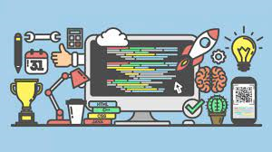

  One of the biggest and most frequently asked question I get as a unversity student, and as a computer-science major is "What are your plans are after you graduate?". It's one of my most dreaded questions as I spend hours wondering and contemplating what is the best route to go down. Which then leads back to "Why do I want to become a programmer?" I think this is a very complicated answer but can simply be boiled down to enjoyment.

I've had many opportunties to utilze my abilities and to teach others how to program as well. From these experiences I was able to at least think about why I enjoy programming and what I'd like to do after I graduate. Honestly I find the entire field of subject interesting but there are definitly areas where I'm more interested in.

Before getting into computer science, I was actually an Electrical Engineering Major. Not realizing how much math, and calculations and physical simulations and other factors take place I later switched into computer science. Computer Science presents itself with its own difficulties and challenges. And often times when learning computer science, you wonder "How does this apply to real life?"

Luckily for me I was able to know a bit of programming before going into the study. Having learned Java in highschool and having a internship where I got to utilize my coding knowledge to program HVAC systems I quickly understood the importance of coding and how versatile the application was. So when I switched into the Computer Science major I wasn't completely lost. 

Some applications of computer science I'd be interested in pursuing would be Robotics, App and Web Development and Video Game Production. All of these utilize completely different languages, builds, IDEs and syntaxs that don't overlap. But I think that makes it more interesting. If in the future, I'm able to enter all of these fields, I believe that it'll allow me to have one of the broadest scopes of the subject as a whole. 

Even as I write this, I'm still contemplaiting whether or not I'd find a job in my field of study after graduation, so hopefully I can take things one stride at a time to eventually reach my goal.
