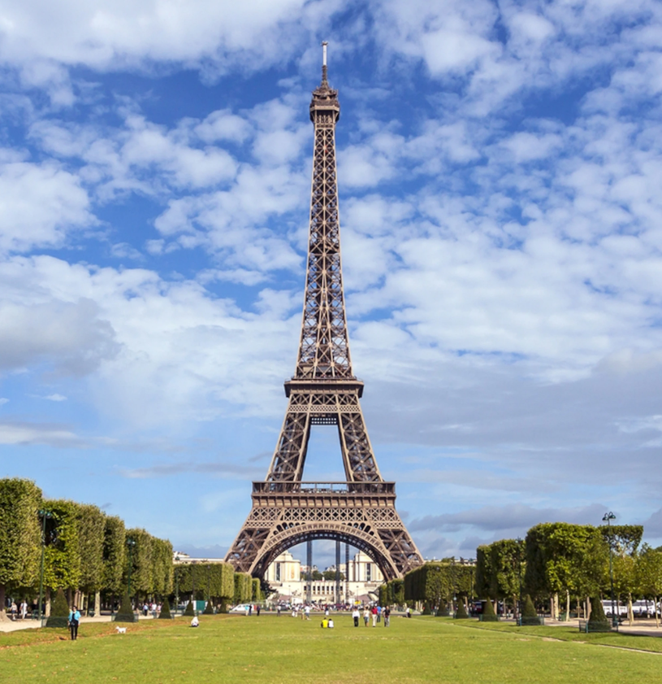

In my Environmental Politics Class, I was able to do a brief study on the policies implemented by France. Some of the research I was able to do was very interesting. France tends to be an early adopter of global policies to reduce carbon footprints and waste, but frequently does not meet these goals.

Conventions like the Rotterdam Convention and the Stockholm convention were aimed at reducing and eliminating hazardous chemicals and persistant organic polutants. And even the Paris agreement had set a concrete goal of keeping the rise of temperatujre below 2 degrees celcius and had every country submit a nationally determined contribution.

France tends to be a very forward thinking country in its promises to go through with these policies, but conflicts greatly when it comes to their actual movement. The country is heavily dependant on Nuclear Power and has many domestic issues when it comes to air and water polution.

If you'd like to read the whole paper, you can read it [here](https://docs.google.com/document/d/1Fg1m4ACVbk-6YKbg3Dgc6iGI5GdGe93hQinsCFdwsSk/edit?usp=sharing)
