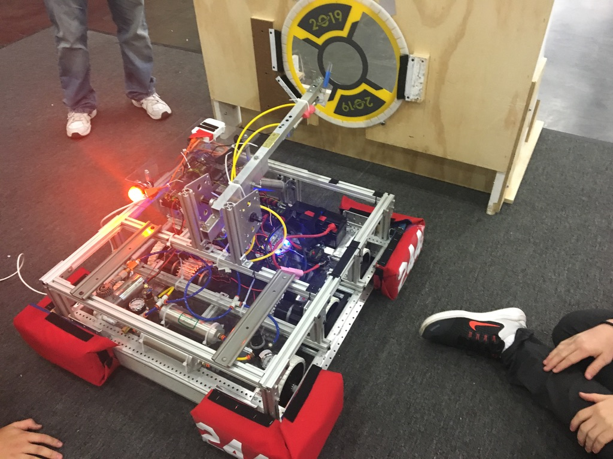
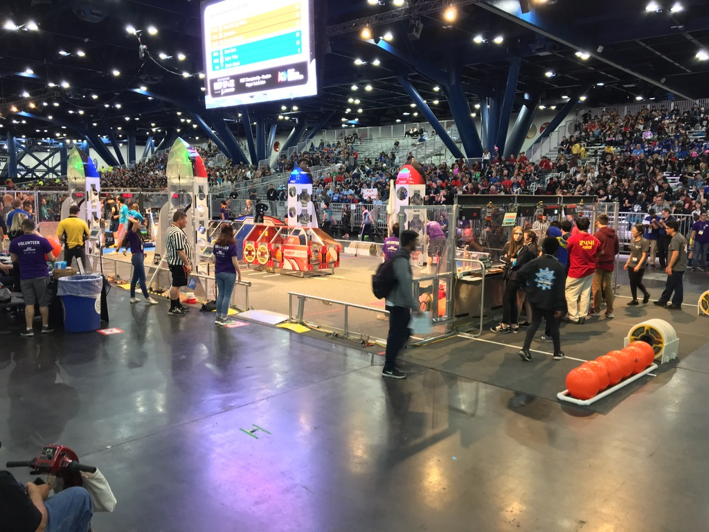
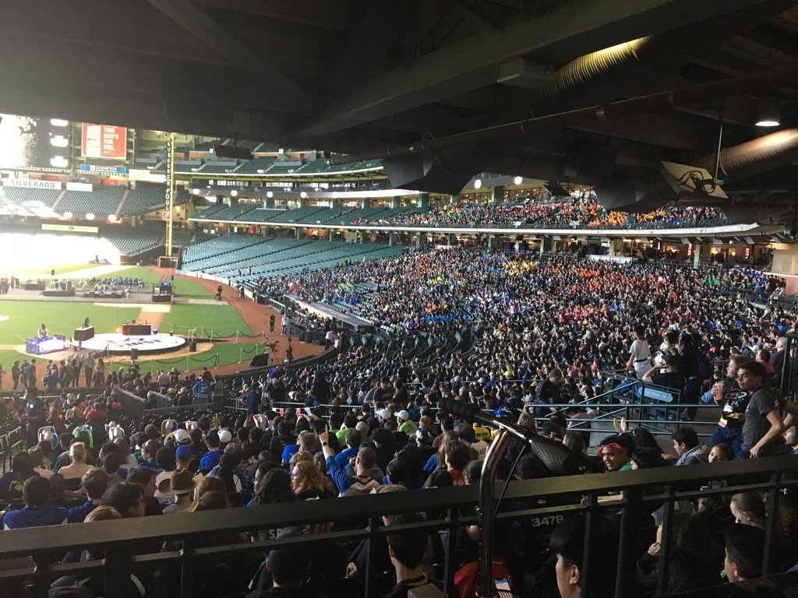

Over the past 5 years, I've had the opportunity to teach Robotics to a few schools across the island. The opportunity has taught me much about how students think, feel, plan and prioritize.

During that time I was able to teach students about the engineering process and programming.

Through the engineering process, students were tasked with planning, designing, prototyping and building a competition level robot with the intention of competing against schools from around the state, nation and globe. 

Depending on the grade level, students were given different languages to learn, although teaching students programming fundamentals allowed them to transition between languages with much less difficulty. These languages included; C, Java, LabView, python and various graphical based programming languages. 

My students were also given the opportunity to compete both locally and on the international level. Many of my students were given opportunities to compete in the World Championships after proving themselves at the regional level.

This opportunity gave many local students a much broader view than just locally at how vast the world of robotics is. 

Take a look at some of their work [here](https://www.ksrobowarriors.org)
